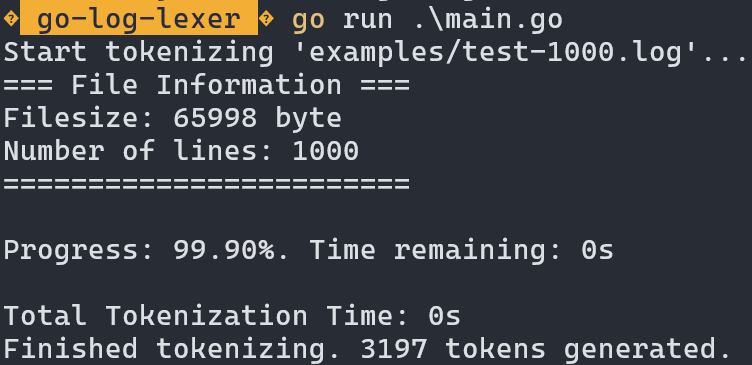

# Go-Log-Lexer

Welcome to the go-log-lexer project! This project written in Go Language Version 1.22, utilizes the SDK Go 1.22.1.

## Overview

This project is aimed at creating a log lexer in Go. It provides functionalities to parse and analyze logs.

## Getting Started

To get started with `go-log-lexer`, you will need:

- Go programming language version 1.22
- Go SDK 1.22.1

1. Clone the repository.
2. Install the necessary dependencies.
3. Start working on or with it!

## Start the lexer

To start the lexer you can run following command in the main directory:

```bash
$ go run .\main.go
```

This will give an output like this:



To run another file, you can change the configuration in the `main.go`:

```go
[...]

// Configuration
var logFile = "examples/test-1000.log"

[...]
```

## Usage

You will find more detailed instructions in the respective directories of the project.